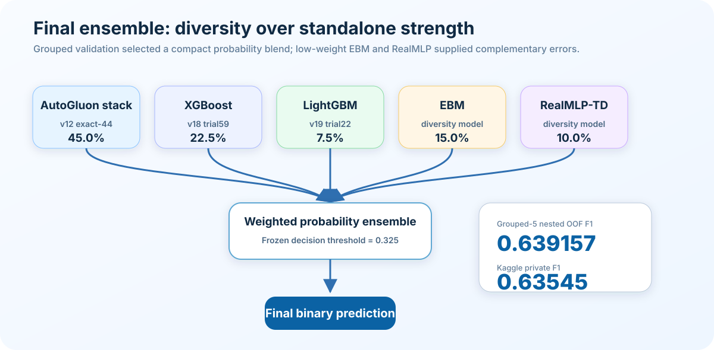
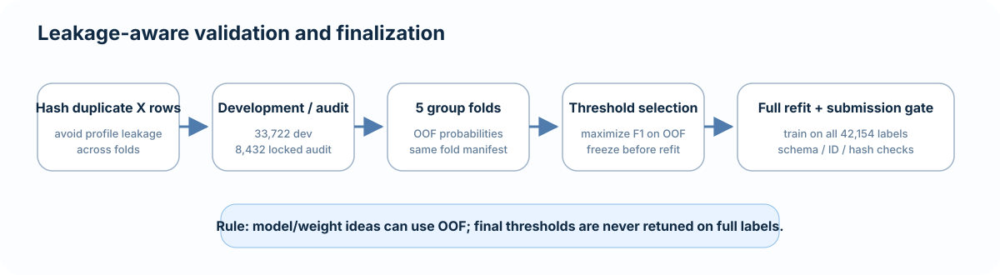

# Final campaign results

## Champion

The final champion is:

`v21_base_ebm_15_realmlp_10_single.csv`

- Kaggle ref: `56876458`
- Public F1: `0.63267`
- Private F1: `0.63545`
- Grouped-5 nested OOF F1: `0.6391573586`
- Frozen threshold: `0.325`
- SHA256: `ce9d8c6774903b4d7eff418adff1806a47a1c0895569bec281eb34312055e563`

The candidate uses 75% of the previous v12/XGB/LGB probability anchor, 15% EBM, and 10% RealMLP-TD. Expanding the anchor gives effective weights of 45% v12, 22.5% XGB, 7.5% LGBM, 15% EBM, and 10% RealMLP-TD.

## Why it worked

EBM and RealMLP were not competitive standalone models. Their value came from complementary errors:

- EBM OOF correlation vs v12/XGB/LGBM/TabM: approximately `0.979 / 0.979 / 0.966 / 0.978`.
- RealMLP OOF correlation vs v12/XGB/LGBM/TabM: approximately `0.961 / 0.960 / 0.952 / 0.963`.

RealMLP was especially useful because it was materially less correlated with the existing model family while still containing enough signal to help at a small weight.

## Validation workflow

## Important leaderboard lesson

The locally best v21 recipe was not the private-leaderboard winner.

- OOF-best: 85% base + 5% EBM + 10% RealMLP, nested F1 `0.639431`, private F1 `0.63389`.
- Private-best: 75% base + 15% EBM + 10% RealMLP, nested F1 `0.639157`, private F1 `0.63545`.

This means exact blend ordering is below the observed validation/leaderboard noise floor. OOF was still useful to identify a credible region, but further fine weight sweeps would risk leaderboard overfitting.

## Final v22 audit

The final high-value hypothesis was a leakage-safe logistic stack with optional slice-aware soft gating.

The meta-model used frozen OOF probabilities from v12, XGB, LGBM, TabM, EBM, and RealMLP. Candidate slice variables were limited in advance to doctor recommendation, age, employment status, and three H1N1 opinion variables. Meta-model selection happened inside each outer fold.

Results:

- v21 parent nested F1: `0.639157`
- pure logistic stack: `0.636470`
- best 50/50 parent + stack: `0.637378`
- folds improved vs parent: `2 / 5`
- gain vs parent: `-0.001779`

The predeclared gate required at least `+0.0005` nested F1 and improvement on at least 4/5 folds. It failed decisively, so no v22 candidate was submitted.

## Stopping decision

The campaign stopped after v22 because:

1. the strongest remaining low-capacity combination method failed under nested validation;
2. exact blend-weight ordering had already shown high leaderboard noise;
3. additional model families had diminishing standalone quality;
4. the project had already found two v21 blends above the previous best private score;
5. further local/LB sweeps had lower information value than overfitting risk.

The final recommended artifact is therefore the frozen v21 champion recorded in `CHAMPION.json`.
